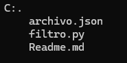

# Filtro Python
## Descripción
En este repositorio se buscaba hacer un programa que pudiera vender una serie de servicios del internet y telefonía y tener almacenados los datos de los usuarios
## Tecnologías utilizadas
- PYTHON
- JSON

## Estructura del proyecto

## Características
|Nombre|Descripción|
|--|--|
|**archivo.json:** |Este archivo contiene todos los datos de los usuarios|
|**filtro.py:**|Este archivo contiene todo el código que hace funcionar el programa|
## Contacto
E-mail: luismiguel110205@gmail.com
## Autor
- **Luis Miguel Caicedo Bermon**